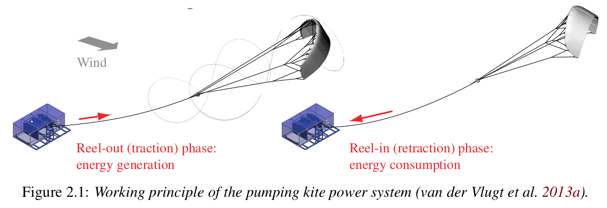

# WinchModels

## Introduction
This package shall implement different models of ground stations for airborne
wind energy system. A ground station has the following components:
- motor/generator
- gearbox (optional)
- drum

Currently implemented is a model of the 20kW ground station from Delft University of Technology.

## Exported types
```julia
AsyncGenerator
```

## Exported functions
```julia
calc_reactance
calc_inductance
calc_resistance
calc_coulomb_friction
calc_viscous_friction
calc_acceleration
```
<p align="center"></p>

## See also
- [Research Fechner](https://research.tudelft.nl/en/publications/?search=Uwe+Fecner&pageSize=50&ordering=rating&descending=true)
- The application [KiteViewer](https://github.com/ufechner7/KiteViewer)
- the package [KiteUtils](https://github.com/ufechner7/KiteUtils.jl)
- the package [KitePodModels](https://github.com/aenarete/KitePodModels.jl)
- the package [KiteModels](https://github.com/ufechner7/KiteModels.jl)
- the package [KiteControllers](https://github.com/aenarete/KiteControllers.jl)
- the package [KiteViewers](https://github.com/aenarete/KiteViewers.jl)


