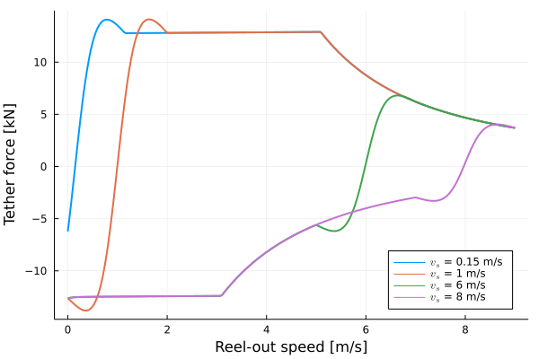
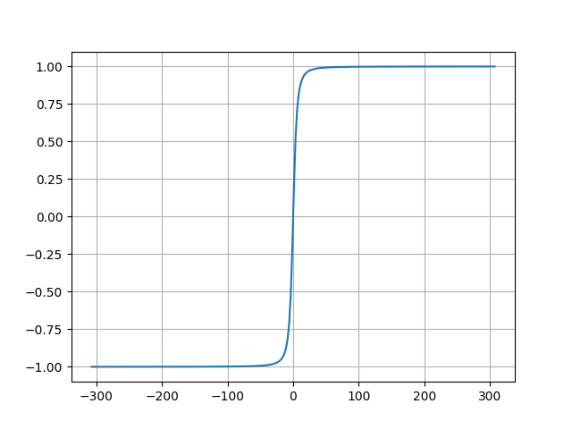

# WinchModels
[](https://github.com/aenarete/WinchModels.jl/actions/workflows/CI.yml?query=branch%3Amain)
[](https://codecov.io/gh/aenarete/WinchModels.jl)

## Introduction
This package shall implement different models of ground stations for airborne
wind energy system. A ground station has the following components:
- motor/generator
- gearbox (optional)
- drum

Currently implemented is a model of the 20kW ground station from Delft University of Technology.

## Installation
```julia
]add https://github.com/aenarete/WinchModels.jl
```

## Exported types
```julia
AbstractWinchModel
AsyncMachine
```

## Main functions
```julia
calc_acceleration(wm::AsyncGenerator, set_speed, speed, force, use_brake = false)
calc_force(wm::AsyncGenerator, set_speed, speed)
```
<p align="center"></p>

### Plot of function "calc_force"
<p align="center"></p>

## Helper functions
```julia
calc_reactance
calc_inductance
calc_resistance
calc_coulomb_friction
calc_viscous_friction
smooth_sign
```
### Plot of function "smooth_sign"
<p align="center"></p>

## Performance
```julia
using WinchModels, BenchmarkTools

wm = AsyncGenerator()
@benchmark calc_acceleration(wm, 7.9, 8.0, 100.0)
```
On i7-7700K 17ns for Julia, 1050ns with Python.

## See also
- [Research Fechner](https://research.tudelft.nl/en/publications/?search=Uwe+Fecner&pageSize=50&ordering=rating&descending=true)
- The application [KiteViewer](https://github.com/ufechner7/KiteViewer)
- the package [KiteUtils](https://github.com/ufechner7/KiteUtils.jl)
- the packages [KiteModels](https://github.com/ufechner7/KiteModels.jl) and [KitePodModels](https://github.com/aenarete/KitePodModels.jl) 
- the package [KiteControllers](https://github.com/aenarete/KiteControllers.jl) and [KiteViewers](https://github.com/aenarete/KiteViewers.jl)


